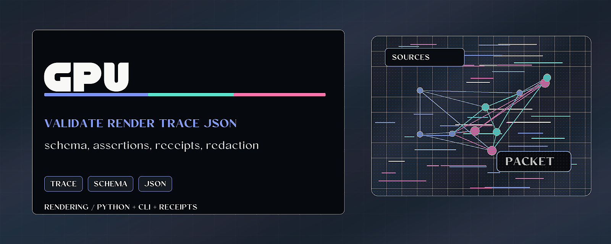

# GPU Trace Validator



> Validate render trace JSON and emit bounded, redacted receipts.

GPU Trace Validator checks GPU or renderer trace fixtures against a bundled JSON
schema. It reports assertion counts, expected failures, and redacted summaries so
rendering demos can carry evidence without exposing raw private payloads.

## Why it matters

Creative and scientific renderers need more than screenshots. A trace validator
gives demos and CI jobs a compact receipt that says whether the recorded render
metadata still matches the expected contract.

## Try it

```bash
python -m pip install -e ".[test]"
gpu-trace-validator tests/fixtures/trace_pass.json
python -m pytest
```

## What to test first

- Validate a bundled or local trace JSON file.
- Run with `--expect-failures 0 --json`.
- Run the test suite before changing schemas or report wording.

## Current status

Python package and CLI for validating trace fixtures produced elsewhere. It does
not capture GPU work and does not certify renderer correctness.

## Existing technical notes

> Validate GPU trace JSON against a schema; emit bounded, redacted receipts.

[](LICENSE)


[](https://github.com/HarperZ9/gpu-trace-validator/actions/workflows/ci.yml)
[](https://harperz9.github.io)

## Install

```bash
python -m pip install gpu-trace-validator
```

## Usage

```bash
gpu-trace-validator trace.json
gpu-trace-validator --expect-failures 0 --json trace.json
```

The JSON Schema ships inside the package and is used by default, so `--schema`
is only needed to override it with your own file. See [USAGE.md](USAGE.md) for
worked examples, expected output, and the importable Python API.

## Notes

- This CLI validates format and assertion summaries.
- It does not capture GPU work; it validates fixtures produced elsewhere.
- `--expect-failures` reports whether observed assertion failures matched the
  expected count.
- Reports are summaries, not certification or trust verdicts.
- JSON schema files are bundled with the package.

---
**Zain Dana Harper** — small tools with explicit edges.
[Portfolio](https://harperz9.github.io) · [HarperZ9](https://github.com/HarperZ9)
<sub>Built with Claude Code; reviewed, tested, and owned by me.</sub>
