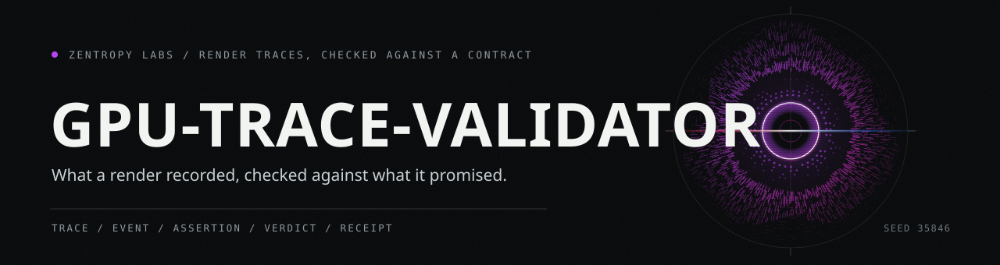

<p align="center"></p>

# GPU Trace Validator

> Validate render trace JSON and emit bounded, redacted receipts.

GPU Trace Validator checks GPU or renderer trace fixtures against a bundled JSON
schema. It reports assertion counts, expected failures, and redacted summaries so
rendering demos can carry evidence without exposing raw private payloads.

## Why it matters

Creative and scientific renderers need more than screenshots. A trace validator
gives demos and CI jobs a compact receipt that says whether the recorded render
metadata still matches the expected contract.

## Try it

```bash
python -m pip install -e ".[test]"
gpu-trace-validator tests/fixtures/trace_pass.json
python -m pytest
```

## What to test first

- Validate a bundled or local trace JSON file.
- Run with `--expect-failures 0 --json`.
- Run the test suite before changing schemas or report wording.

## Current status

Python package and CLI for validating trace fixtures produced elsewhere. It does
not capture GPU work and does not certify renderer correctness.

## Existing technical notes

> Validate GPU trace JSON against a schema; emit bounded, redacted receipts.

[](LICENSE)


[](https://github.com/HarperZ9/gpu-trace-validator/actions/workflows/ci.yml)
[](https://harperz9.github.io)

![Eight stages of validating one recorded trace: trace, schema, source, events, assertions, verdicts, expectation, and exit code. A trace is one JSON object; a root that is an array or a string is refused before any check runs. Six fields are required at the root, and an unexpected property is named with its path rather than ignored, at the root and inside every frame, resource and event. Source records one of four capture kinds, from a JSON replay, a RenderDoc capture, a live hook, or a hand-written fixture, alongside where it came from. Events carry nine kinds, each pinned to a sequence number and a frame, and errors are sorted by path so two runs over the same trace read alike. Only the assertion kind carries a verdict. Verdicts have four values, of which two are counted: a failure and an unknown. A verdict of not-applicable is counted as neither, so it lands with the passes. Expectation compares observed failures against a number the caller supplied. The exit code is zero unless something was refused or a count did not match. Three outcomes: pass, fail, and not read.](docs/art/trace-lane.svg)

## Install

```bash
python -m pip install gpu-trace-validator
```

## Usage

```bash
gpu-trace-validator trace.json
gpu-trace-validator --expect-failures 0 --json trace.json
```

The JSON Schema ships inside the package and is used by default, so `--schema`
is only needed to override it with your own file. See [USAGE.md](USAGE.md) for
worked examples, expected output, and the importable Python API.

![Eight stages of an expectation run: fixture, count, observed, compare, summary, redact, bound, and receipt. A fixture may be recorded to fail on purpose, which is how a check proves it can fail at all. The caller names how many assertion failures to expect. The validator counts how many the trace actually carries. The comparison runs in both directions, so fewer failures than expected is refused exactly as firmly as more. With no expected count supplied, the expectation is reported as not checked and any failure at all fails the run. Each failure is summarized into at most nine named fields: sequence, frame, pass, stage, slot, resource, the assertion text, the verdict, and the provenance. No raw buffer or payload is carried out. Every string in the summary goes through the same redactor, which removes private key blocks, cloud access key ids, three token prefixes, named secrets, and absolute paths of both kinds. Nothing longer than two hundred and forty characters survives, and truncation runs after redaction. The result is one JSON object, printed whole or as a short summary. Three outcomes: matched, missed, and not checked.](docs/art/expectation-lane.svg)

## Notes

- This CLI validates format and assertion summaries.
- It does not capture GPU work; it validates fixtures produced elsewhere.
- `--expect-failures` reports whether observed assertion failures matched the
  expected count.
- Reports are summaries, not certification or trust verdicts.
- JSON schema files are bundled with the package.

![Eleven ways a trace run ends, one to a row, with the status reported and why it lands there. A failed verdict fails the run when no expected count was given, and the error names how many failures were seen. The accented row is the unknown verdict: the assertion report reads unknown while the run still exits zero, because unknown is a reading about the trace rather than a refusal of it. A trace where every verdict passes reports pass. So does a trace that asserts nothing at all, since nothing was refused. So does a trace full of not-applicable verdicts, which are counted as neither failures nor unknowns. A fixture recorded to fail on purpose passes when the failures observed equal the number supplied, and fails when that count moves in either direction, since fewer failures than expected is refused exactly as firmly as more. An unexpected property fails wherever it sits, at the root or inside a frame, a resource or an event. A value outside any of the three closed sets fails and is named with its path. If the schema library will not import, or the schema will not compile, that error is reported rather than passed over. A trace whose root is not a JSON object is refused before any check runs, and the command exits one without printing a receipt.](docs/art/status-table.svg)

---
**Zain Dana Harper** -- small tools with explicit edges.
[Portfolio](https://harperz9.github.io) | [HarperZ9](https://github.com/HarperZ9)
<sub>Built with Claude Code; reviewed, tested, and owned by me.</sub>

## For developers

Keep the public README, package metadata, and examples aligned with current behavior. Before opening a PR or pushing a release, run the local package verification path.

```bash
python -m pip install -e ".[test]"
python -m pytest
```

---

**[Zentropy Labs](https://github.com/ZentropyLabs-ai)** · order out of entropy. An independent lab building evidence-first tools that leave a re-checkable artifact behind. Built by Zain Dana Harper in Seattle. The full workbench is at [Project Telos](https://harperz9.github.io).
